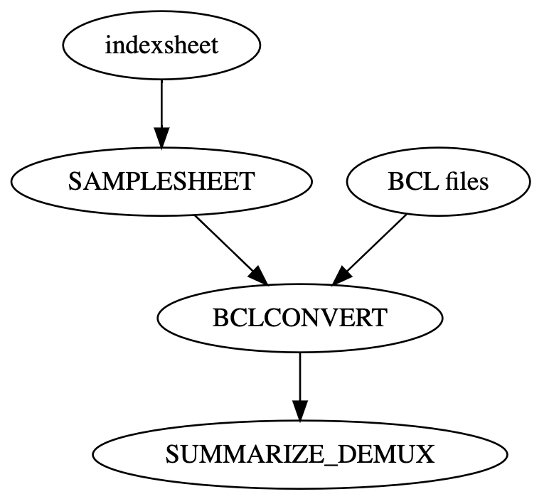

# seqWell Demultiplex From Basecall Nextflow Pipeline


This is the Nextflow pipeline to demultiplex illumina data for the seqWell ExpressPlex and Pureplex Multiplexing Kit.
The pipeline uses [bcl-convert](https://emea.support.illumina.com/sequencing/sequencing_software/bcl-convert.html) for converting basecall data into fastq.
The pipeline is as shown in the image below.

The pipeline starts with basecall files and index sheet and has the following steps:

1. The `SAMPLESHEET` process,  creates samplesheet using information from index sheet.
2. The `BCLCONVERT` processe converts basecall data into fastq files.
3. The `SUMMARIZE_DEMUX` process generate summary metrics in excel format from the reports from the `BCLCONVERT` processe. 

The final output from this pipeline includes BCLCONVERT output files, demultiplexed FASTQ files, a demultiplexing summary.




## Dependencies

This pipeline requires installation of [Nextflow](https://www.nextflow.io/docs/latest/install.html).
It also requires installation of a containerization platform such as [Docker](https://docs.docker.com/engine/install/).

## Docker Containers

All docker containers used in this pipeline are publicly available.

- *BCLCONVERT*: seqwell/bcl-convert:4.2.7
- *python*: seqwell/python:v1.0


# How to run the pipeline:

## Required Parameters

The required parameters are *run_name*, *indexsheet*, *bcl_path* and *out_dir*.

### `indexsheet`

`indexsheet` is the path to a CSV file.

There are four required columns:

- *Sample_Plate*: Identifier to be used in naming the run plate for the wells included in the demux process.
  Can contain letters, numbers, dash ('-') and underscore ('_') in `Sample_Plate`. Must have at least one letter.
- *Sample_Well*: Wells in the run plate to be demuxed.
  Must be any of the wells in the 96-well plates, such A01, A02, etc.
- *i7* and *i5*: i7 and i5 barcode.

### `bcl_path`
The bcl data directory path can be a local absolute path or an AWS S3 URI.
If it is an AWS S3 URI, please make sure to [set your security credentials appropriately](https://www.nextflow.io/docs/latest/amazons3.html#security-credentials).

### `run_name`
Charater identifier of the run. It will be used to name the summary report.

### `out-dir`

The output directory path can be a local absolute path or an AWS S3 URI.
If it is an AWS S3 URI, please make sure to [set your security credentials appropriately](https://www.nextflow.io/docs/latest/amazons3.html#security-credentials).

## Profiles:

Several profiles are available and can be selected with the `-profile` option at the command line.

- `apptainer`
- `aws`
- `docker`
- `singularity`

## Example Command

A minimal execution might look like:

```bash
nextflow run \
    -profile docker \
    main.nf \
    --indexsheet ${PWD}/path/to/indexsheet.csv \
    --bcl_path ${PWD}/path/to/bcl_path \
    --run_name 'test_run' \
    --out_dir ${PWD}/path/to/out_dir \
    -resume  -bg 
```

# Running Test Data

## With Docker

The pipeline can be run using included test data with:

```bash
nextflow run \
    -profile docker \
    main.nf \
    --indexsheet "${PWD}/tests/example_indexsheet.csv" \
    --bcl_path "${PWD}/tests/example_BCL" \
    --run_name 'example' \
    --out_dir "${PWD}/test_output" \
    -resume  -bg 
```
The above bash code is saved in the file *nextflow.sh*.  
When you get this repo, you can do a quick test using the example data in the tests folder by running *bash nextflow.sh*.

## Expected Outputs

```
├── example
│   ├── D-4003_FASTQ
│   │   ├── D-4003_A01_R1_001.fastq.gz                          ### demuxed reads
│   │   ├── D-4003_A02_R1_001.fastq.gz                          ### the example data happend to be single end, but it will work for paired reads
│   │   ├── D-4003_A03_R1_001.fastq.gz
│   │   ├── D-4003_A04_R1_001.fastq.gz
│   │   ├── D-4003_A05_R1_001.fastq.gz
│   │   ├ ...
│   │   ├── D-4003_H10_R1_001.fastq.gz
│   │   ├── D-4003_H11_R1_001.fastq.gz
│   │   └── D-4003_H12_R1_001.fastq.gz
│   ├── Logs                                                    ### the logs from bclconvert process
│   │   ├── Errors.log
│   │   ├── FastqComplete.txt
│   │   ├── Info.log
│   │   └── Warnings.log
│   ├── Reports                                                 ### the original reports from bclconvert process
│   │   ├── Adapter_Cycle_Metrics.csv
│   │   ├── Adapter_Metrics.csv
│   │   ├── Demultiplex_Stats.csv
│   │   ├── Demultiplex_Tile_Stats.csv
│   │   ├── IndexMetricsOut.bin
│   │   ├── Index_Hopping_Counts.csv
│   │   ├── Quality_Metrics.csv
│   │   ├── Quality_Tile_Metrics.csv
│   │   ├── RunInfo.xml
│   │   ├── SampleSheet.csv
│   │   ├── Top_Unknown_Barcodes.csv
│   │   └── fastq_list.csv
│   ├── Undetermined_S0_L001_R1_001.fastq.gz                    ### the undetermined reads
│   └── example.xlsx                                            ### combine original reports in the spreadsheet report
└── example_indexsheet_samplesheet.csv                          ### the samplesheet created from the idexsheet
```
